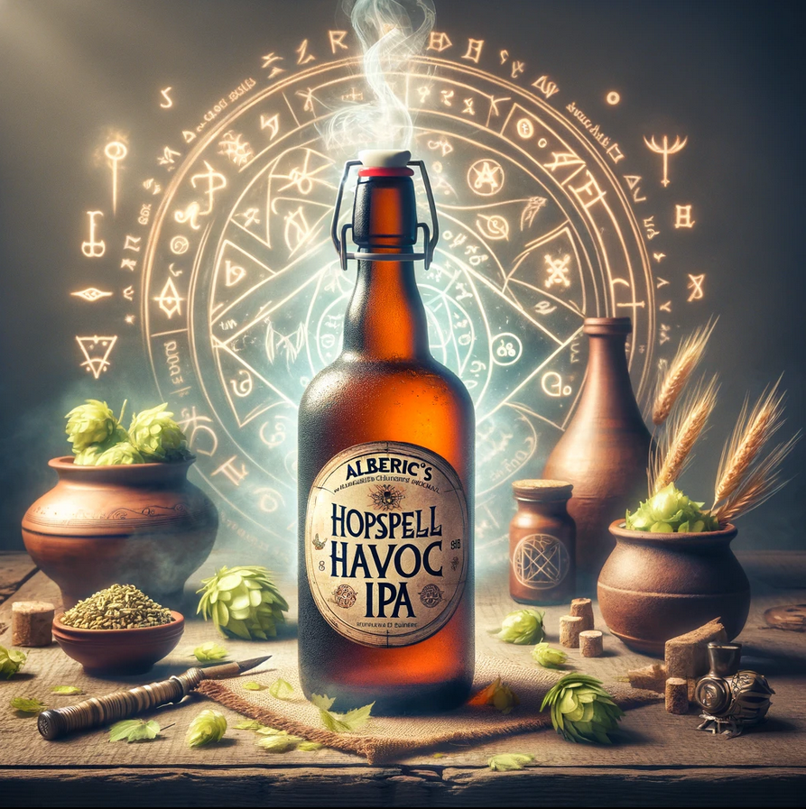
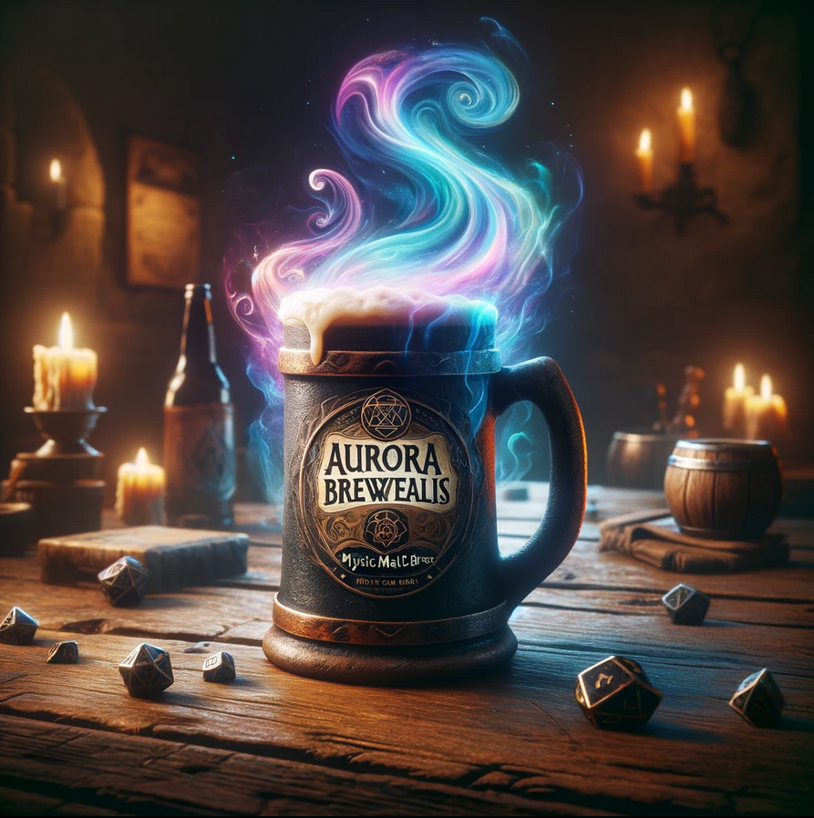
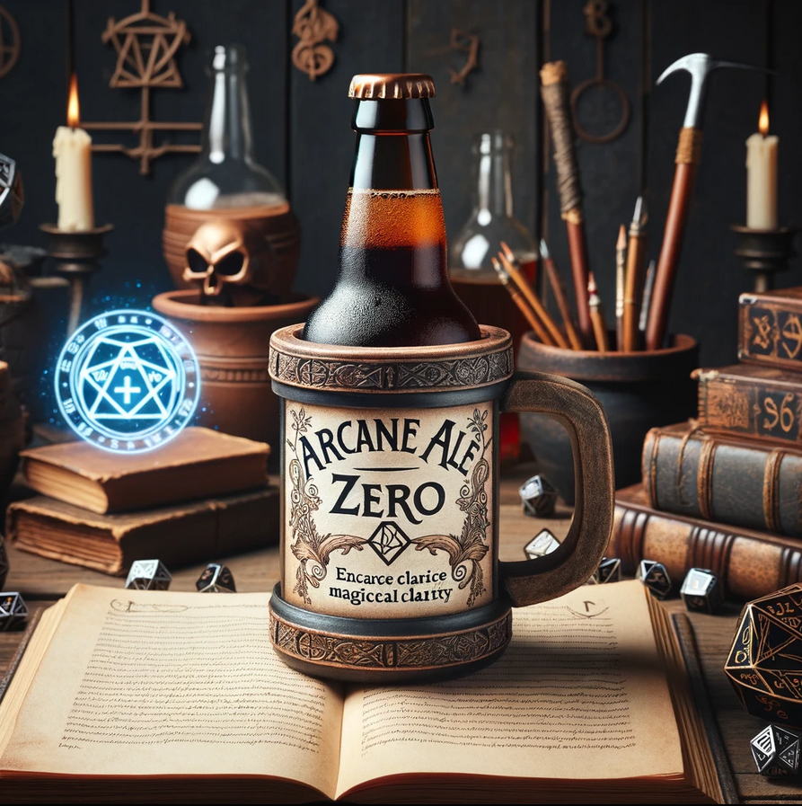
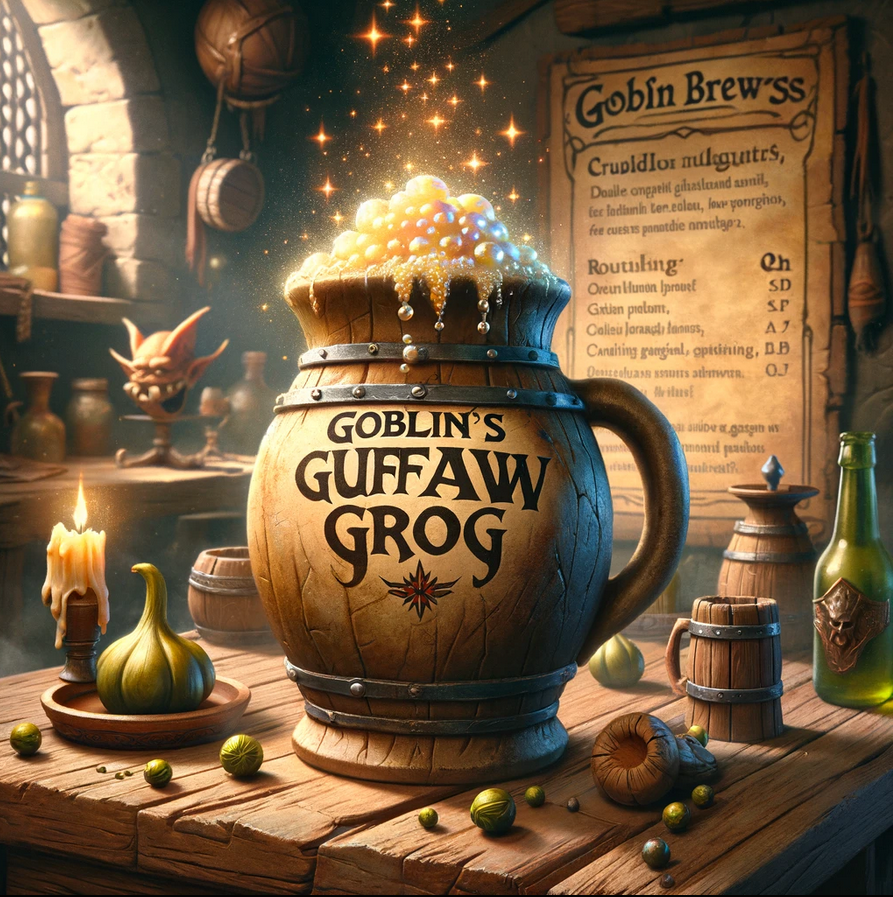
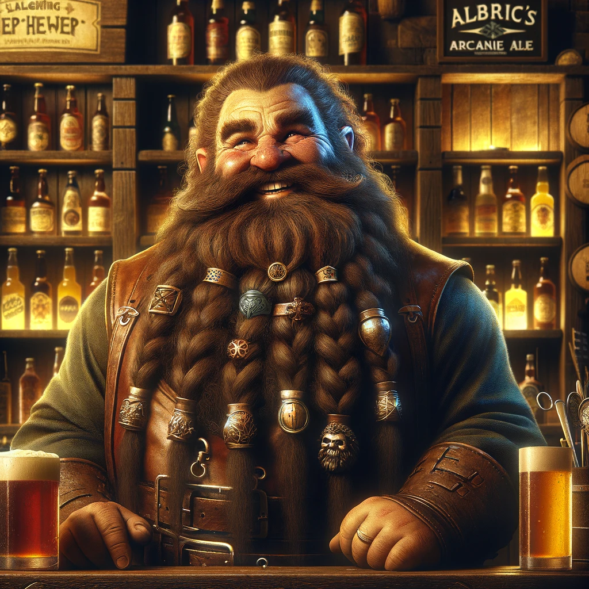

## Starting off

The adventuring party has gathered under the banner of `Globetrotter Guilds, Inc.`, a company known for recruiting and deploying fresh talents to various quests across the land. Each member, newly graduated from their respective academies and schools, finds themselves at the threshold of real-world adventure, armed with theoretical knowledge and newly issued gear.

The characters find themselves in `The Laughing Beholder`, a cozy and popular pub in the bustling heart of `Meridian's Crest`. The pub is known for its wide selection of magical and mundane beers from across the realm, including offerings from `Mystic Malt Brews`, `The Sober Sorcerer`, and even the elusive `Alberic's Arcane Ales`.  The part is there to talk with `Borin Deepkeg`, the owner.

The Laughing Beholder

### Beer selection at The Laughing Beholder
- Alberic's brewery is called `Alberic's Arcane Ales`
    - known for `Hopspell Havoc IPA`: seems to make people more aware but gives a firefly hangover the next day
        - `Brewer's Boon`: For the next hour, they gain an enhanced sense of perception, granting them the ability to detect hidden doors, traps, and illusions within a 15-foot radius. Additionally, this boon gives a +1 bonus to AC (Armor Class), as the drinker's heightened senses allow them to react more swiftly to threats. However, due to the potent magic infused within the hops, those who partake may also experience vivid, hop-filled dreams the next time they sleep, providing insights or cryptic messages from the brew itself.
        - `Magical Hangover`: The next day, the character suffers from a magical hangover, experiencing disorienting flashes of arcane energy that obscure their vision. They have disadvantage on Perception checks and cannot benefit from the Brewer's Boon for 24 hours.
        
- Mystic Malt Brews
    - `Aurora Brewealis` stout
        - mesmerizing to look at as it is to taste, with swirling colors that mimic the northern lights in a glass
        - gives `night vision` for 1 hour
        - `Sensory Overload`: After the night vision fades, the drinker's senses become overwhelmed by normal levels of light, causing all attack rolls and ability checks that rely on sight to have disadvantage for the next hour.
        
- The Sober Sorcerer
    - `Arcane Ale Zero`, a non-alcoholic beer
        - `Clarity of Mind`: +2 bonus to Wisdom and Intelligence checks for an hour
        - `Overly Focused`: The character becomes so mentally acute that they find it difficult to ignore minor details, resulting in a -2 penalty to all Wisdom saving throws as they become easily distracted by irrelevant information.
        
- Goblin Grogworks
    - robust and hearty grogs, this brewery uses unconventional ingredients
    - known for `Goblin's Guffaw Grog`
        - `Burst of Laughter`: consumer finds everything hilariously funny for the next 30 minutes. This effect is contagious, prompting anyone who hears the drinker's laughter to make a Wisdom saving throw or succumb to fits of laughter themselves. While under this effect, social interactions are made with advantage, as the laughter breaks down barriers and eases tensions.
        - `Uncontrollable Snickering`: Even after the initial 30 minutes, the drinker finds themselves prone to fits of snickering at inappropriate times. They must make a Charisma saving throw to maintain composure during serious or stealthy situations for the next 24 hours.
        

## The Hook

The tavern owner, a jovial dwarf named `Borin Deepkeg`, reveals his concern over missing shipments of `Alberic's Arcane Ale`. His worry deepened after sending one of his employees to check on Alberic's brewery, only for them to vanish without a trace. The party's task is to investigate the brewery, discover the fate of Alberic and the tavern employee, and secure the future of the ale's delivery.

The Quest

`Secondary Objective`: Borin, with a more secretive tone, mentions that if the adventurers stumble upon the recipe for Alberic's Arcane Ale, he's willing to offer an additional 10,000 gold pieces for its retrieval. However, he stresses this part of the mission must remain between them, as Globetrotter Guilds, Inc. would not condone the appropriation of such valuable intellectual property.

## The Quest
1. `Discover the Fate of Alberic Hopsbeard`: Unravel the mystery of the brewmaster's disappearance. Is he in need of rescue, or has he become one with his chaotic creation?
2. `Secure the Legendary Brew Recipe`: Bronn believes that within the depths of the Draught Dungeon lies the secret to Alberic's most extraordinary creation, the Hopspell Havoc IPA. Retrieving this recipe could not only immortalize The Laughing Beholder but also grant the characters a share of the fame and fortune that would come with brewing such a legendary ale.

Bronn promises the characters a handsome reward for their efforts—exclusive lifetime patronage at The Laughing Beholder, a significant sum of gold, and a stake in the future profits from the legendary brew they're tasked to retrieve. Additionally, the adventure represents an opportunity to become heroes of the brewing world, a title that carries its own weight in many circles.

The characters must travel thru the enchanted forest a one day trek to get to Alberic's brewery.

