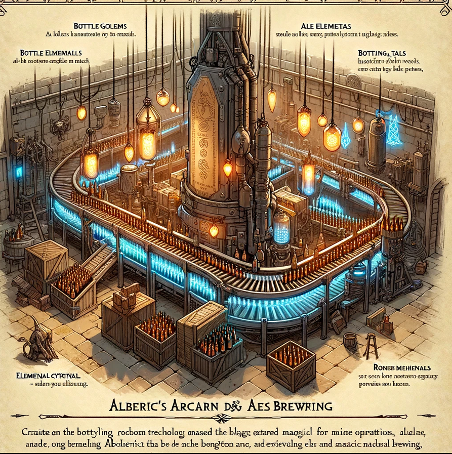
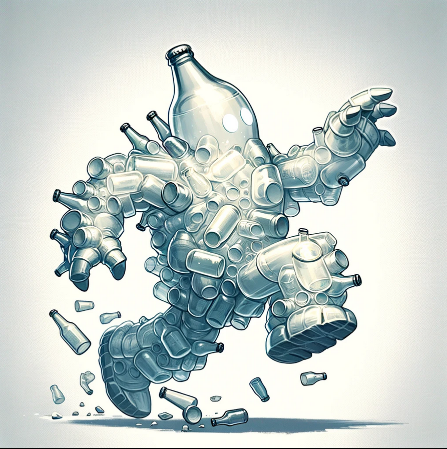

# Alberic's Arcane Ales -  Level 2

Bottling Room

Upon descending the staircase from Alberic's study, the party enters the Bottling Room. This room is where the magical brews of Alberic's Arcane Ales are prepared for distribution, featuring medieval technology enhanced with magic.

## Inhabitants of the Bottling Room

Bottle Golems

Small constructs made from leftover bottles and brewery waste, animated by the residual magic of the room.

- **AC:** 13
- **HP:** 10 (2d6+3)
- **Speed:** 30 ft.
- **Attacks:** Projectile (Bottle Throw) +3 to hit, range 20/60 ft., one target. **Hit:** 4 (1d4+2) piercing damage.
- **Special Abilities:** Shatter on Impact - Upon hitting a target or missing with a throw, the Bottle Golem shatters, potentially causing 1 (1d2) piercing damage to nearby creatures.

Ale Elementals

Sentient beings formed from spilled magical brews, with bodies made entirely of sloshing ale.

- **AC:** 8
- **HP:** 18 (4d8)
- **Speed:** 20 ft., swim 30 ft.
- **Attacks:** `Ale Soak` +3 to hit, reach 5 ft., one target. **Hit:** 5 (1d6+2) bludgeoning damage, and the target is soaked in ale, causing disadvantage on its next attack roll due to slippery hands.
`Bottle throw`: +3 to hit, 1d4 +3 damage
- **Special Abilities:** Summon Barrel - Can enter and animate a barrel of ale, turning a barrel into a barrel brawler.

