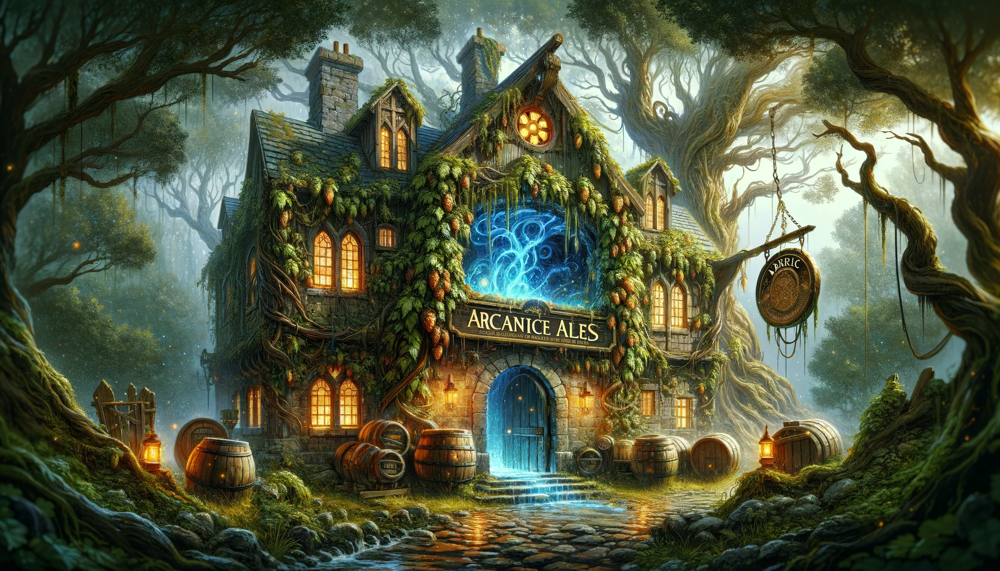
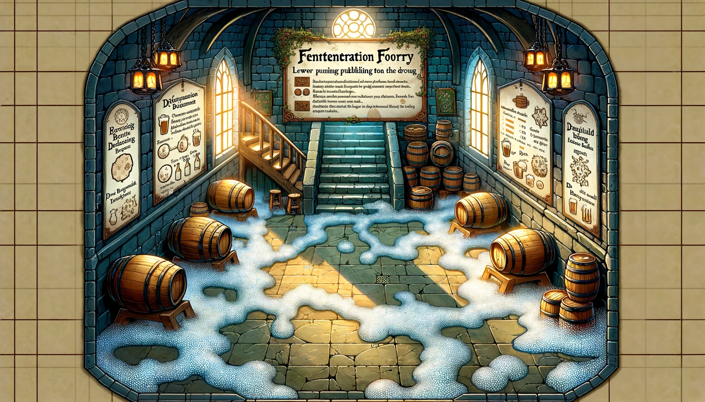
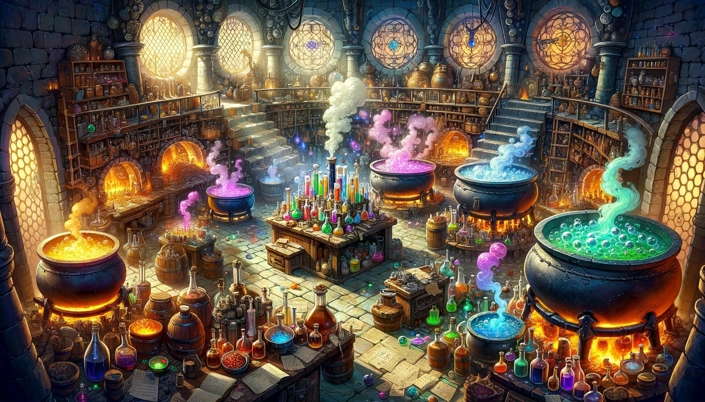

# The "Misguided Wizard's Brewery"

<strong>Entrance</strong>

<strong>Level 1: The Fermentation Foyer and Ale-chemy Labs</strong>

Entrance - The Fermentation Foyer

The room is tiled with enchanted stones that mimic the carbonation of a freshly poured ale. As adventurers step into the room, the floor beneath them begins to fizz and pop magically.

#### Random Effects for the Magical Traps:
Player must make a dexterity save of 15 or trigger a trap
- `Feeling Woozy`: Players must make a Constitution saving throw or become disoriented from the yeast smell, suffering disadvantage on their next attack roll or ability check.
- `Slippery Steps`: A sudden burst of fermented foam makes the floor slick. Players must make a Dexterity saving throw or fall prone.
- `Giggles`: A burst of laughter-inducing gas. Players failing a Wisdom saving throw find themselves laughing uncontrollably, unable to take reactions until their next turn.
- `Barrel Brawler`: One of the barrels animates and makes a clumsy attack against the nearest player.
    Barrel Brawler Stats:
        `AC`: 12
        `HP`: 10
        `Attack`: +2 to hit, reach 5 ft., one target. Hit: 3 (1d6) bludgeoning damage.
        Special: On destruction, the barrel releases a burst of hop-scented mist, granting temporary advantage on Constitution saving throws against being intoxicated for 1 minute to anyone within 5 feet.
- `Mystical Mumble`: Players hearing whispering voices must succeed on an Intelligence saving throw or be compelled to speak in rhymes for the next 10 minutes, which may affect spellcasting with verbal components.

Ale-chemy Laboratory

Once a place of magical research, now filled with bubbling cauldrons producing unpredictable potions. Funny NPC: A soused apprentice who gives cryptic hints in exchange for taste-testing his "creations."

### NPC: The Soused Apprentice

- **Name:** Gilbin Fizzwhistle
- **Race:** Gnome
- **Age:** 37
- **Basic Stats and Abilities:**
  - **Intelligence:** 16 (Smart but erratic)
  - **Wisdom:** 8 (Lacks common sense)
  - **Charisma:** 14 (Charming in a quirky way)
  - **Ability:** Can concoct a random potion effect on the spot, but not always with the intended results.

### Interaction and Sayings:
- **Greeting:** "Ah, new test subjects! I mean... guests! Care to try a sample of my latest concoction?"
- **On Potion Effects:** "Side effects? Oh, they're half the fun! Who doesn't enjoy a surprise or two?"
- **When Asked for Help:** "I could give you a hint, but where's the fun in that? Instead, how about you help me with a little experiment?"
- **On Failure:** "Well, back to the drawing board. Or maybe just back to the board. Who needs drawing anyway?"
- **On Success:** "Eureka! It worked! Mostly... I mean, you're still standing, right?"

### List of 10 Random Potions:

1. **Elixir of Giggles**
   - **Good Effect:** Grants advantage on saving throws against being frightened for 1 hour.
   - **Bad Effect:** Causes uncontrollable laughter, imposing disadvantage on stealth checks.

2. **Potion of Hasty Feet**
   - **Good Effect:** Increases movement speed by 10 feet for 10 minutes.
   - **Bad Effect:** Imposes disadvantage on Dexterity checks due to overly speedy movements.

3. **Brew of Bulging Biceps**
   - **Good Effect:** Grants a +2 bonus to Strength checks for 1 hour.
   - **Bad Effect:** Imposes disadvantage on Dexterity saving throws due to cumbersome muscles.

4. **Draught of Diminution**
   - **Good Effect:** Allows the drinker to temporarily shrink, facilitating movement through tight spaces.
   - **Bad Effect:** Makes the drinker's voice squeaky, potentially alerting nearby creatures.

5. **Vial of Vivid Visions**
   - **Good Effect:** Grants darkvision for 8 hours.
   - **Bad Effect:** Causes mild hallucinations, imposing disadvantage on Wisdom (Perception) checks.

6. **Tincture of Tangled Tongue**
   - **Good Effect:** Grants proficiency in a new language for 1 hour.
   - **Bad Effect:** Jumbles the drinker's words, imposing disadvantage on Charisma (Persuasion) checks.

7. **Flask of Fickle Fate**
   - **Good Effect:** Gives the drinker advantage on one saving throw of their choice in the next hour.
   - **Bad Effect:** Forces the drinker to roll disadvantage on their next attack.

8. **Decoction of Dwarven Might**
   - **Good Effect:** Increases the drinker's Constitution score by 2 for 1 hour.
   - **Bad Effect:** The drinker gains a voracious appetite, requiring immediate consumption of food or suffer disadvantage on Constitution saving throws.

9. **Serum of Swift Speech**
   - **Good Effect:** Allows the drinker to speak and read twice as fast, benefiting spellcasting with verbal components.
   - **Bad Effect:** The drinker speaks so quickly that others have difficulty understanding them, imposing disadvantage on social interactions.

10. **Philter of Phasing**
    - **Good Effect:** Grants the ability to pass through solid objects for 10 seconds.
    - **Bad Effect:** The drinker becomes slightly translucent, reducing their AC by 1 for 1 hour due to the unstable phasing effect.

### The Yeast Beast Room
A monster made entirely of sentient, angry yeast. Defeating it requires clever thinking and possibly some of the bizarre potions from the Ale-chemy Lab.

### Storeroom (Puzzle)
A room filled with barrels that must be arranged in a specific order to open the secret passage to the next level. Each barrel is humorously labeled with things like "Liquid Courage" and "Eau de Gorgon."

Level 2: The Bottling Bazaar and Draught Dungeon

    The Bottling Bazaar: An assembly line gone awry. Adventurers must navigate through or fix the chaotic bottling machinery. Funny NPC: A robot with an identity crisis, believing it's a medieval knight.
    The Tavernacle: A tavern-like room where adventurers can rest, but the patrons are illusions; interacting with them triggers amusing scenarios.
    The Draught Dungeon: Final boss room, where the wizard is trying to contain a massive, animated beer keg monster. Real-world parallel: The wizard's obsession with perfection and control reflects on modern society's pursuit of unattainable ideals, leading to absurd situations.

Environmental Setting: The Enchanted Forest of Misdirection

Surrounding the brewery is a forest that subtly misleads adventurers back to the dungeon entrance unless they solve riddles given by talking trees, parodying GPS technology's occasional unreliability.
Rooms and Features:

    Entrance Hall with a Complimenting Trap
    Ale-chemy Laboratory with a soused apprentice
    The Yeast Beast Room
    Storeroom Puzzle with Barrel Arrangement
    The Bottling Bazaar with a knightly robot
    The Tavernacle with illusory patrons
    The Draught Dungeon with the final boss

This layout offers a blend of combat, puzzles, and role-playing opportunities, with a humorous twist that keeps the atmosphere light and engaging. The dungeon's size and complexity are designed to fit into a 4-5 hour session, with each room offering unique challenges and laughs.